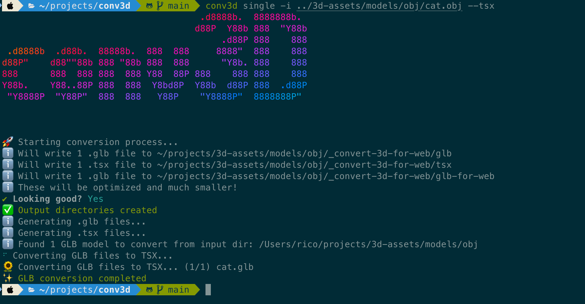

# 3D Model Converter

An interactive command-line tool for converting 3D models (GLTF, FBX, OBJ) to GLB format and generating React components for use with react-three-fiber.

## Features

- Interactive CLI, shows you what it creates and asks for confirmation
- Bulk Mode for converting multiple 3D models at once
- Supports GLTF, FBX, and OBJ file formats
- Generates React/TSX components using gltfjsx

## Installation

```bash
npm install -g conv3d
```

## Example Usage:

```
                                     .d8888b.  8888888b.
                                    d88P  Y88b 888  "Y88b
                                         .d88P 888    888
 .d8888b  .d88b.  88888b.  888  888     8888"  888    888
d88P"    d88""88b 888 "88b 888  888      "Y8b. 888    888
888      888  888 888  888 Y88  88P 888    888 888    888
Y88b.    Y88..88P 888  888  Y8bd8P  Y88b  d88P 888  .d88P
 "Y8888P  "Y88P"  888  888   Y88P    "Y8888P"  8888888P"


Usage: conv3d [command] [options]

An interactive CLI tool for converting 3D models to GLB format and outputting React components to use with r3f. Supports FBX, OBJ, and glTF input formats.

Options:
  -V, --version      output the version number
  --tsx              Create .tsx files. Per default it will ask for user input.
  --no-tsx           Don't create .tsx files
  --no-optimize      Don't create optimized output GLB files
  -h, --help         display help for command

Commands:
  bulk [options]     Convert all 3D models from a directory
  single [options]   Convert a single 3D model from directory
  tsx-gen [options]  Generate .tsx files for 3D models and optimize .glb for web
  help [command]     display help for command
```

### Single

with tsx files:
```
conv3d single -i ./path/to/3d-model.fbx --tsx
```

without TSX files: 
```
conv3d single -i ./path/to/3d-model.obj --no-tsx
```

### Bulk


## Interactive Conversion Process

The convert command will guide you through the following steps:

1. Select the type of 3D models to convert (GLTF, FBX, or OBJ)
2. The tool will:
   - Create necessary output directories
   - Convert the 3D model files to GLB format
   - Generate React components with gltfjsx
   - Copy the files to your configured project paths

## License

MIT